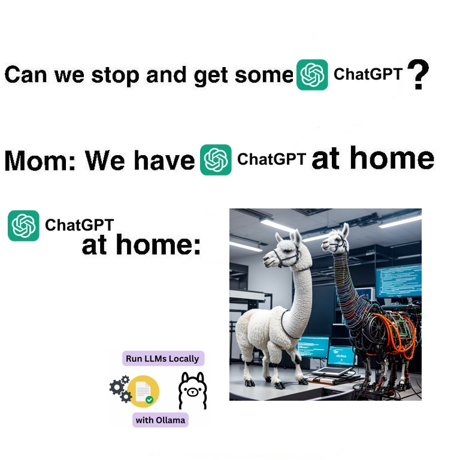
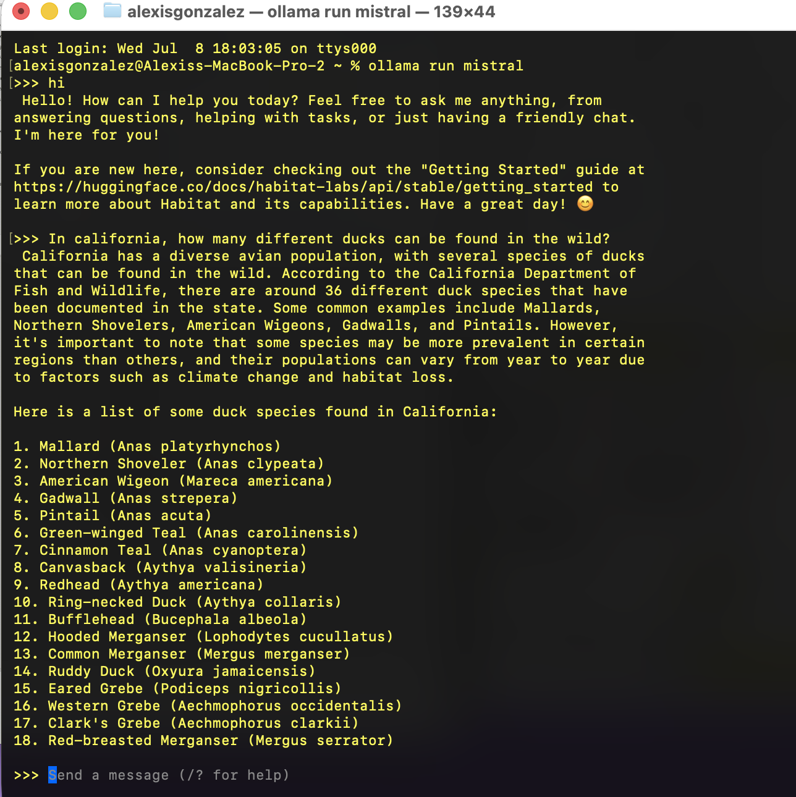
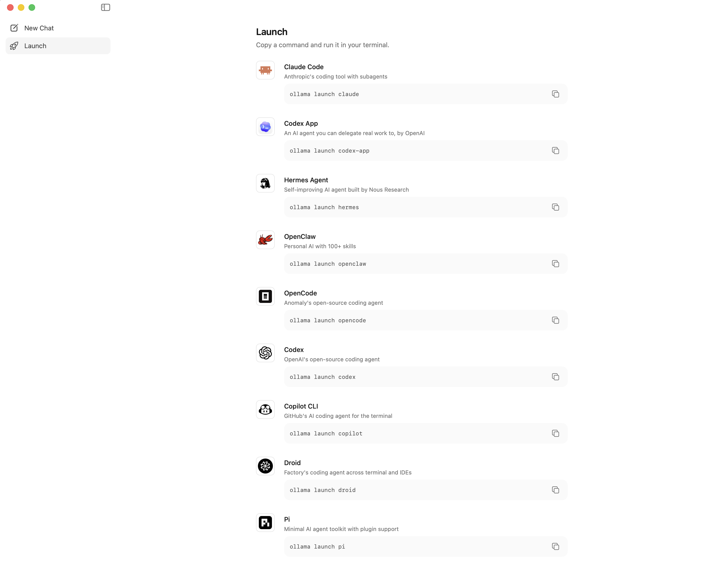

# Get ChatGPT at Home!



Never get ratelimited by ChatGPT again, here's how you run LLMs locally on your computer!

Instructions stolen from this video: https://www.youtube.com/embed/dOm9YWSYbbg?si=rbXvHTTz1cIuktj-

## Get Ollama

Ollama is a command line tool that can manage and run many large language models

1. Download the Ollama app from here:  
   https://ollama.com/download

2. After downloading, follow the first few steps it gives you to move it to the Applications folder and so on.

3. Then, run this terminal command to download and start using an LLM. We'll be using `mistral`, becuase it's a reasonable balance of size (~4 GB) and performance.

```terminal
ollama run mistral
```

## Start using your LLM

After the `ollama run mistral` command finishes (it's a big file, so it'll be 2-5 minutes), you're talking with an LLM just like ChatGPT, but locally hosted on your computer, so it's free and private.



Although we are only working with `mistral` today, there other models you can interact with


