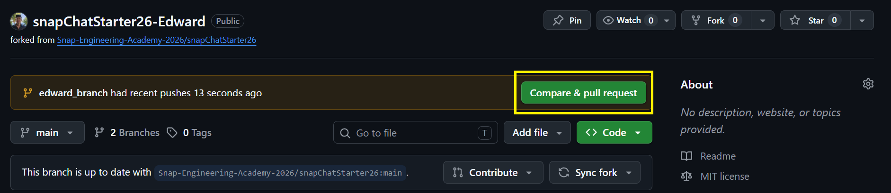
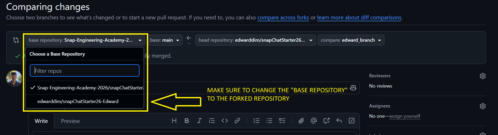
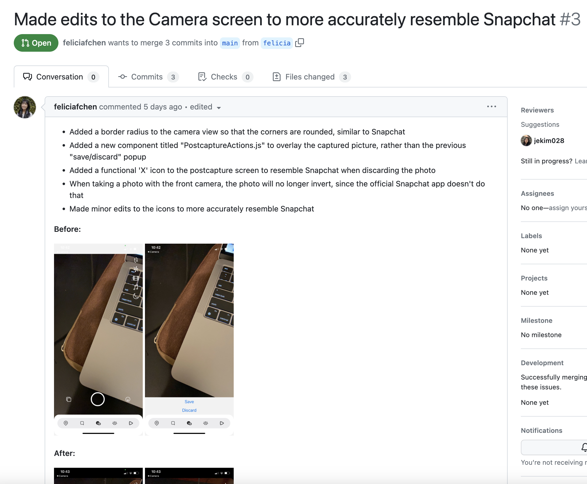
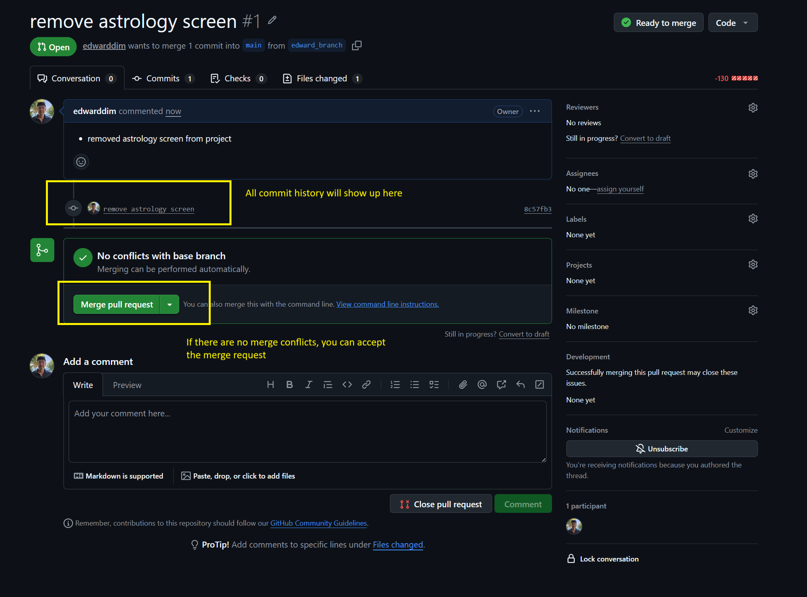

# SDA x SEA Collaboration Project

[Snapchat Starter Code Forkable](https://github.com/Snap-Engineering-Academy-2026/snapChatStarter26)

This will be the starter code for your final project! In your groups of 3, you will be responsible for implementing SDA's project to the given starter code.


### Fork and Clone

One memeber of your group will fork the above repository, then they will add the other 2 members as collaborators to the forked repository. All three should clone copies to their computeres.

After cloning the repo to your computer, **make a new branch** with your name

```bash
git switch -c <dev-YOUR_FIRST_NAME>
```

### Collaborating
As you start adding your code to the project individually, you will eventually start to consolidate your work to the project(the forked repo). To do this you need to do the following.


### A - Add and Commit your changes locally

```bash
git add .
git commit -m "commit message"
```

### B - Push your changes

```bash
git push origin <your-branch-name>
```
<br>

### C - View and starting creating your pull request on Github
1. Navigate to your forked repository on GitHub.
Click on the "Compare & pull request" button: This usually appears after you push your changes to GitHub.



2. When your Pull Request Opens make sure you are checking that you are comparing your branch to the main branch of the classroom repository 




### D - Describe your pull request
In your pull request, please be specific about what updates you have added. The header should summarize the main fixes that your edits address and your comment
should include specific details of exactly what was changed. Please include screenshots of the edited screen before and after your changes. Here is a great 
example from a past scholar.




### E - View your created pull request and merge



<br/>

### Keeping your project updated
[POWER POINT SLIDES](https://docs.google.com/presentation/d/1kNoZK46LqOUZQ5WrOMjvKi9EFxjZ4iKffHqwUNr3U8g/edit?usp=sharing)