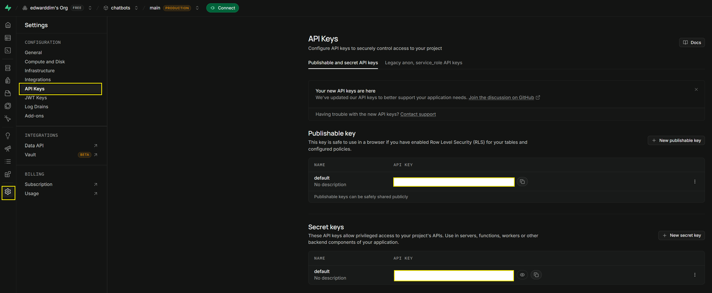
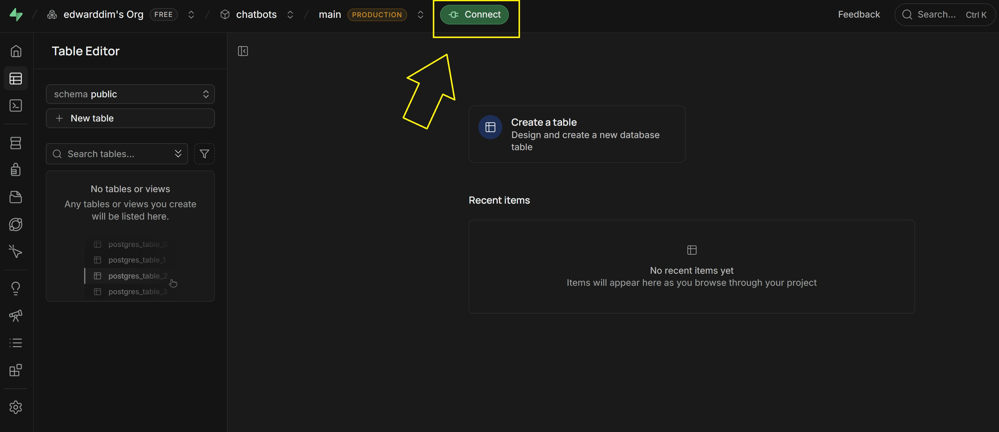
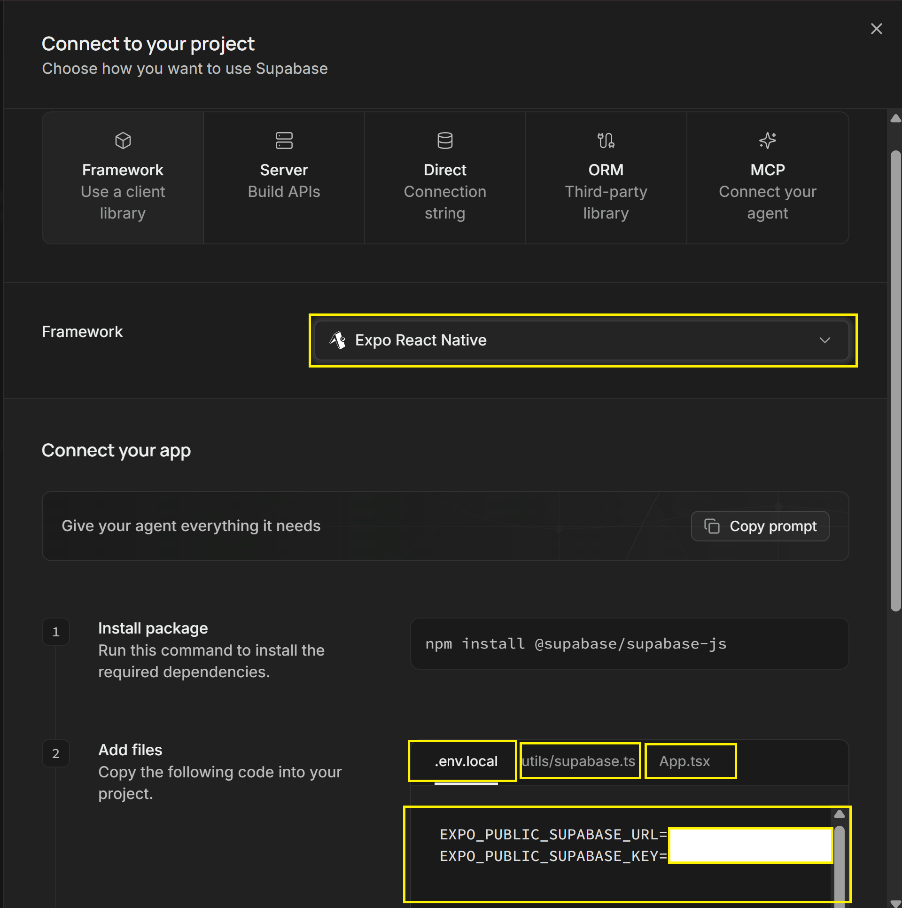
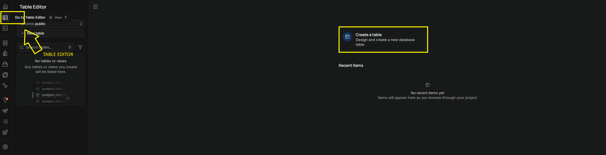
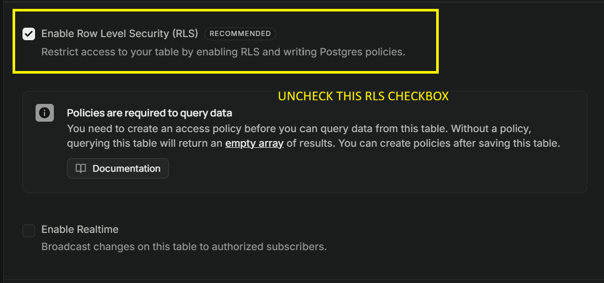
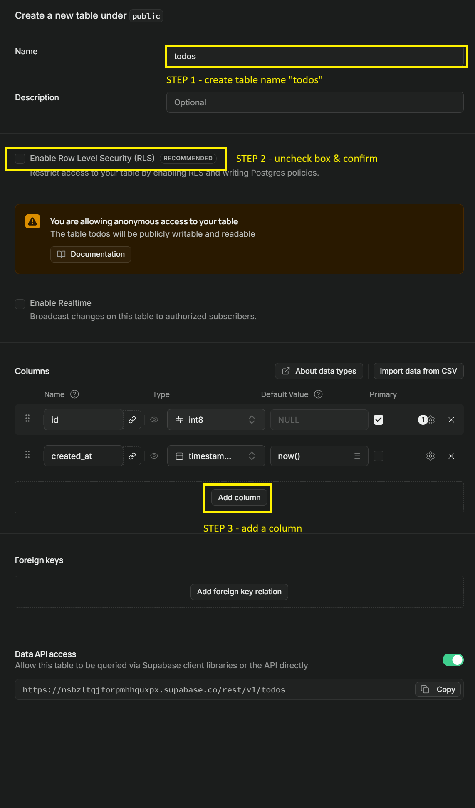
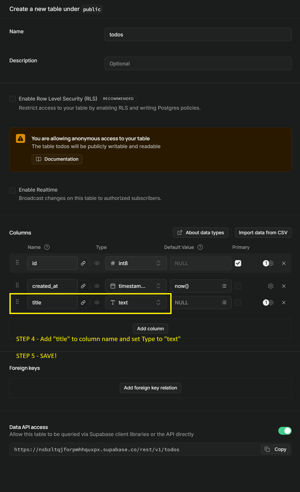
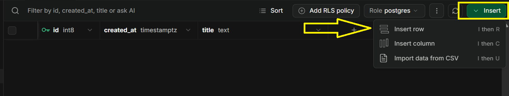
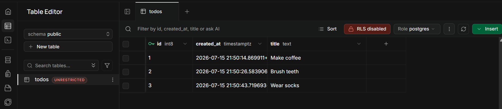

# Adding a database!

🚨 Warning: when copying and pasting your file make sure that the imports match YOUR project structure. This will help avoid the little bugs on the way 🐜 🐜 🚨

We're going to connect your code to a database so we can save the chat history in your conversations, along with some other data.

For our database, we'll be using a database service called Supabase. Supabase is built on top of a popular open source database system called PostgreSQL (or just Postgres). Supabase is also a "hosted" service, which means we don't have to run a separate server to host it ourselves (which can be a pain). Supabase basically adds a hosting service and nice UI to the utilitarian power of Postgres.

## Setting up a Supabase database

1. Create an account on Supabase - https://supabase.com/
2. Create a new organization and a project (recommend calling the org "sea-yourname" and the project something like "chatbots")
3. Wait a few minutes for your database project to be created

> [!IMPORTANT]
> Save the password you created for your project!


## Connecting your app to Supabase

### Let go create some keys:

1. Go to https://app.supabase.com and log in.

2. Open your new supabase your project.

3. On the left sidebar, click ⚙️ Settings → API Keys.
   You’ll see something similar to this:
   
   don't worry about putting these keys in your `.env.local`. The reason why we went looking for keys first is that they auto populate in our `connect` tab once we create them.

> [!Note]
> Notice that there are two types of keys **Publishable** and **Secret** keys. We will be using the **Publishable** keys for our projects. If you are interested in learning the difference between the two keys here is a link for further reading. [Understanding API keys](https://supabase.com/docs/guides/getting-started/api-keys)


### Adding the connection code to our project :

5. From the project dashboard, find the "Connect" button and click it  
   
6. Select the "Frameworks" tab, and select the **Expo React Native** framework.
   
   These are files that contain the connection keys and some example code!
   P.S look at the photo above and note the three files(env.local, utils/supabase.ts, and App.tsx). We won't be using them exactly as written, but they're still very helpful.We'll walk through each of them separately.

### `.env.local`

For the `.env.local` file, we want to put our connection keys in our `.env.local` file. You should already have an environment variable file (aka `.env.local`) with your ChatGPT api key in it, so just add to that! If you don't have one, create the `.env.local` file and add `.env.local` to your `.gitignore` file. Though chances are that it already includes `.env*.local`  to ignore all all environment files. This will ensure that no API keys will be pushed to Github and be exposed.

### `utils/supabase.js`

For the `utils/supabase.ts` file, we want that almost exactly as it, but your file should be called `supabase.js` instead of `supabase.ts`, because we're using JavaScript (`.js`), not TypeScript (`.ts`). Below is the translated file to JavaScript.

<table><tr><td>
<details>
  <summary>Reveal</summary>
   
  ```js
   import AsyncStorage from '@react-native-async-storage/async-storage'
   import { createClient } from '@supabase/supabase-js'
   
   export const supabase = createClient(
     process.env.EXPO_PUBLIC_SUPABASE_URL,
     process.env.EXPO_PUBLIC_SUPABASE_KEY,
     {
       auth: {
         storage: AsyncStorage,
         autoRefreshToken: true,
         persistSession: true,
         detectSessionInUrl: false,
       },
     })
   ```

</details>
</td></tr></table>


Note that this file imports some packages we don't have! Let's install them:

```bash
npx expo install @supabase/supabase-js @react-native-async-storage/async-storage react-native-url-polyfill
npx expo install expo-env
```
> [!Important]
> When running `npx expo install expo-env` you will be asked to create a config file, enter "No".


### `App.js`

For the `App.tsx` file example, we're going to do something a lil wild, so hold on to your socks. We're going to replace our whole `App.js` code with this example, **temporarily**, to check if our setup is working. Before continuing, make sure you've committed and pushed to github recently so you don't lose anything important! Once you're sure you've saved your work (and your socks are secured), copy paste the example code into `App.js`, replacing everything that's there. Below is the translated file to JavaScript.

<table><tr><td>
<details>
  <summary>Reveal</summary>

   ```js
   import React, { useState, useEffect } from 'react';
   import { View, Text, FlatList } from 'react-native';
   import { supabase } from './utils/supabase';
   import { SafeAreaView, SafeAreaProvider } from 'react-native-safe-area-context';
   
   export default function App() {
     const [todos, setTodos] = useState([]);
     useEffect(() => {
       console.log('useeffect')
       const getTodos = async () => {
         try {
           const { data: todos, error } = await supabase.from('tests').select();
   
           if (error) {
             console.error('Error fetching todos:', error.message);
             return;
           }
   
           if (todos && todos.length > 0) {
             console.log(todos)
             setTodos(todos);
           }
         } catch (error) {
           console.error('Error fetching todos:', error.message);
         }
       };
   
       getTodos();
     }, []);
   
     return (
       <SafeAreaProvider>
         <SafeAreaView style={{ flex: 1 }}>
           <View style={{ flex: 1, justifyContent: 'center', alignItems: 'center' }}>
             <Text>Todo List</Text>
             <FlatList
               data={todos}
               keyExtractor={(item) => item.id.toString()}
               renderItem={({ item }) => <Text key={item.id}>{item.title}</Text>}
             />
           </View>
         </SafeAreaView>
       </SafeAreaProvider>
     );
   };
   ```
</details>
</td></tr></table>

>[!Warning]
> When you do this, you'll hopefully get an error that says that the table "todos" cannot be found.

## Addressing `errors fetching todos`

We're hoping for this error, because if you check out the code in `App.js`, it makes sense! Find this line:

```js
const { data: todos, error } = await supabase.from("todos").select();
```

This line tries to access a database table on supabase called "todos". But we don't have one!

So let's make one! From the supabase project dashboard, use the left sidebar to go to the "Table Editor", then find the green "Create a new table" button:




Now let's create a "todos" table, and add a text column called "title"




 

<br>

Then we'll add some dummy data to that table

  

  

<br>

<br>

Now when we run it, we should see the dummy data from your database in your app!


## Fin!

<br>

<br>

<br>

<br>
